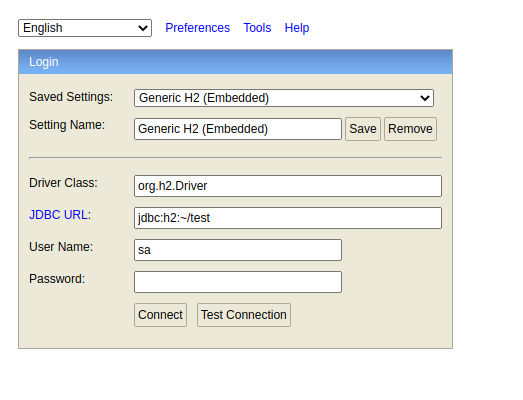

# TicketOpen API
The objective of this project is to build an API, thinking about a task management system. By default this project was developed by my friend. Repository link below.

* [Original Project](https://github.com/matheussilva123/api-ticketopen)

### Diagram of Relational Objects


### Technology
* [Typescript](https://www.typescriptlang.org/)
* [TypeORM](http://typeorm.io/)
* [PostgreSQL](https://www.postgresql.org/)

### Running application - Local

By default, .env is all necessary configs for run this project

```
Run yarn dev:server for Developer Server
```
```
http://localhost:3333
```


### About more project

* [SGA Adobe XD](https://xd.adobe.com/view/40d8efc4-2e34-41e3-b5c9-6facdbc31ca4-158b/)

Repo front
* [TicketOpen](https://github.com/Raafa1993/TicketOpen)
